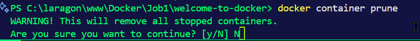
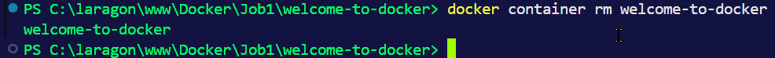
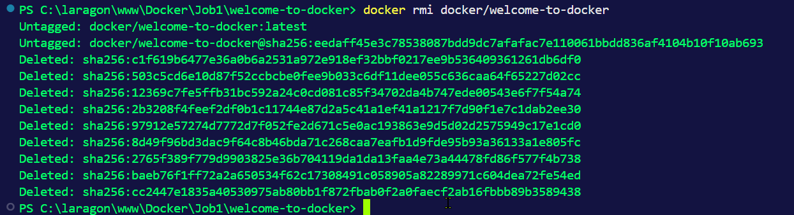
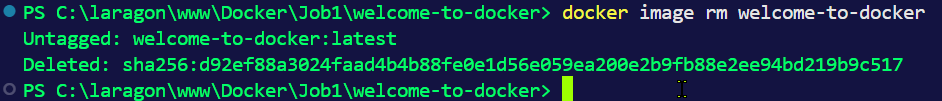
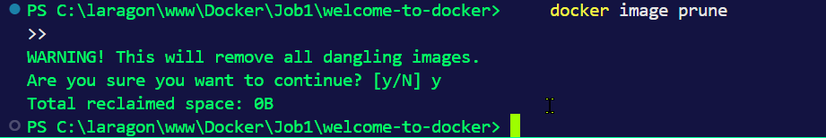
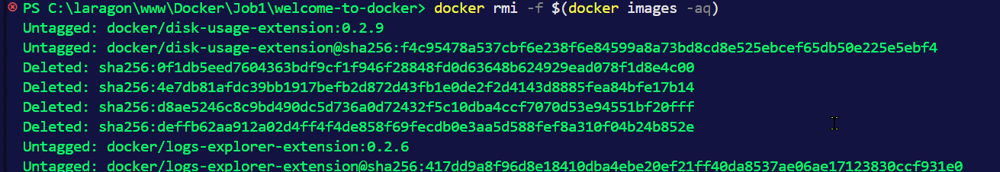
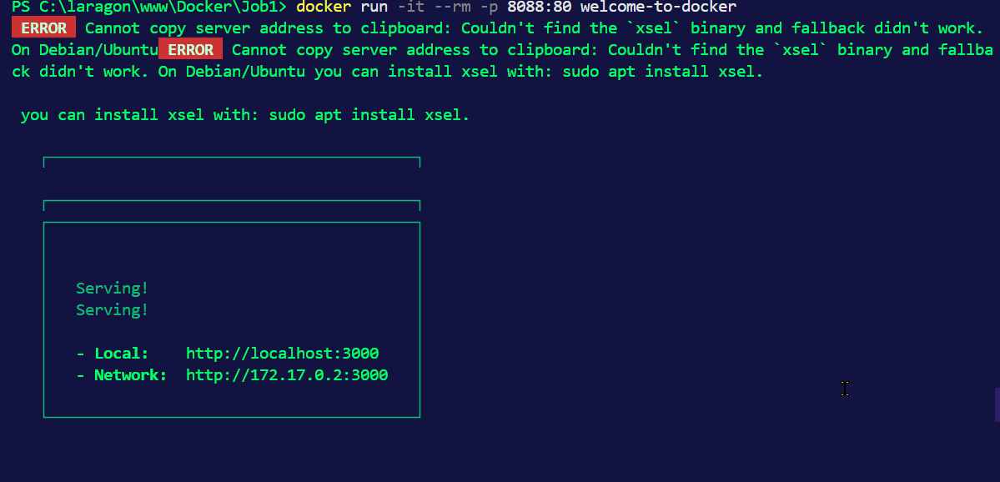

# Commandes de suppressions pour Docker

**1**

*Un conteneur spécifique* 

    docker rm <container_name>

**2**

*Plusieurs conteneurs*

    docker container rm

**3**

*Tous les conteneurs arrêtés*

    docker stop $(docker ps -q)

.png>)

**4**

*Forcer la suppression d'un conteneur actif*

    docker container rm

**5**

*Une image spécifique*

    docker rmi <nomimage>

**6**

*Plusieurs images*

    docker image rm

**7**

*Toutes les images inutilisées*

    docker image prune

**8**

*Toutes les images utilisées*

    docker image rm

**9**

*Forcer la suppression d'une image*

    docker rmi -f IMAGE

**10**

*Quel erreur est présente dans les commandes données ci-dessus, donner la correction* 

    docker run -it --rm -p 8088:80 welcome-to-docker

