# Projet Docker : Welcome to Docker

## Étape 1 : Utiliser Docker via le terminal de Visual Studio

1. **Positionnez-vous dans le dossier du projet :**
   - Ouvrez le terminal intégré de Visual Studio Code.
   - Naviguez vers le dossier `welcome-to-docker`.

   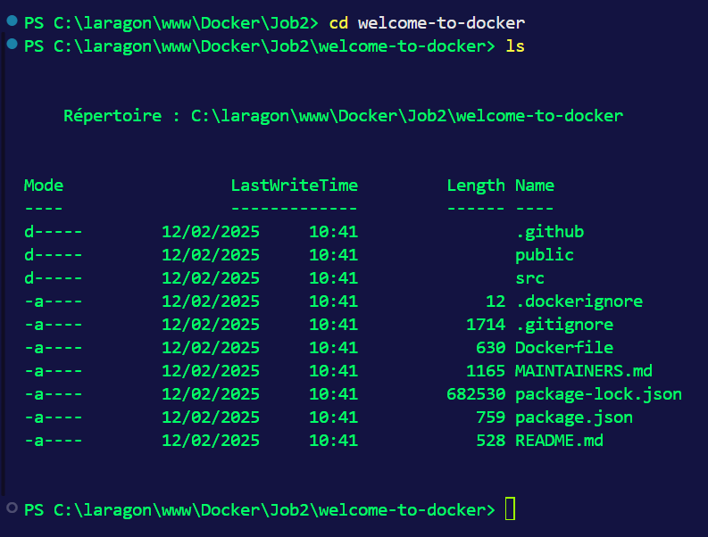

## Étape 2 : Consulter les fichiers présents

2. **Consultez les fichiers présents comme Dockerfile :**
   - Utilisez la commande `ls` pour lister les fichiers dans le dossier.

   

## Étape 3 : Analyser les fichiers

3. **Analysez et comprenez ce que font les fichiers :**
   - Ouvrez le `Dockerfile` et examinez son contenu pour comprendre les instructions Docker.

   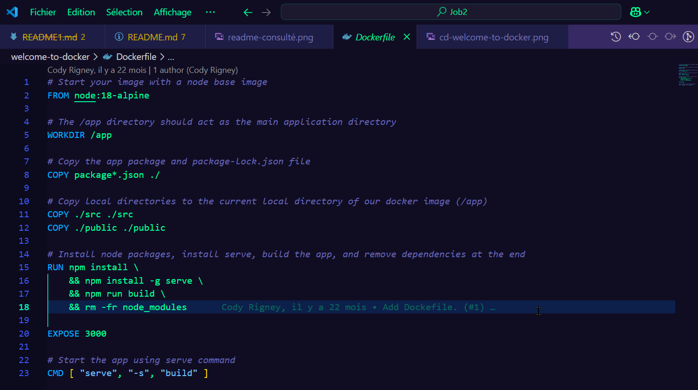

## Étape 4 : Consulter le fichier README.md

4. **Consultez le fichier `README.md` :**
   - Ouvrez le fichier `README.md` pour comprendre les instructions et les informations sur le projet.

  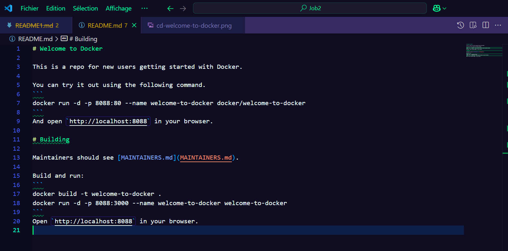

## Étape 5 : Créer l'image Docker

5. **Créez l'image Docker à partir du projet :**
   - Utilisez la commande `docker build` pour créer l'image Docker.

 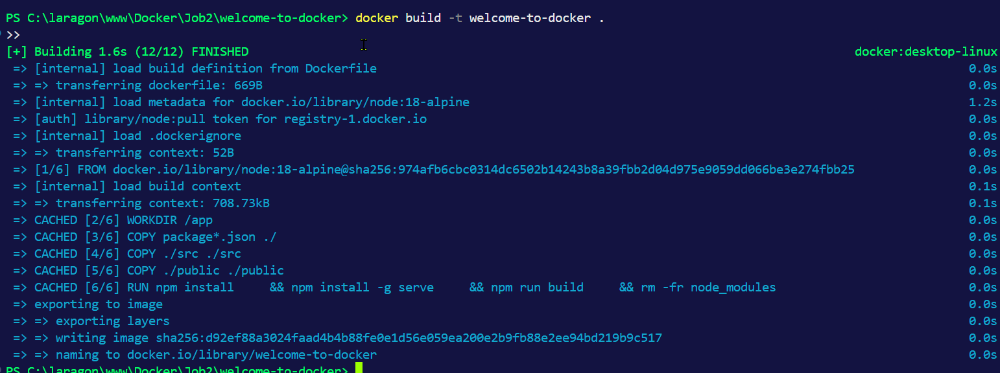

## Étape 6 : Lancer l'image Docker

6. **Lancez l'image Docker et créez un conteneur :**
   - Utilisez la commande `docker run` pour lancer un conteneur à partir de l'image.

   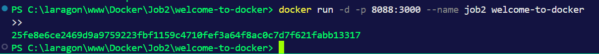

## Étape 7 : Vérifier le conteneur

7. **Vérifiez si le conteneur est lancé :**
   - Utilisez la commande `docker ps` pour vérifier les conteneurs en cours d'exécution.

   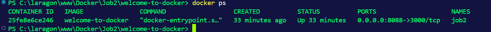

## Étape 8 : Accéder au conteneur

8. **Accédez au conteneur pour visualiser le résultat :**
   - Utilisez la commande `docker exec` pour accéder au conteneur.

   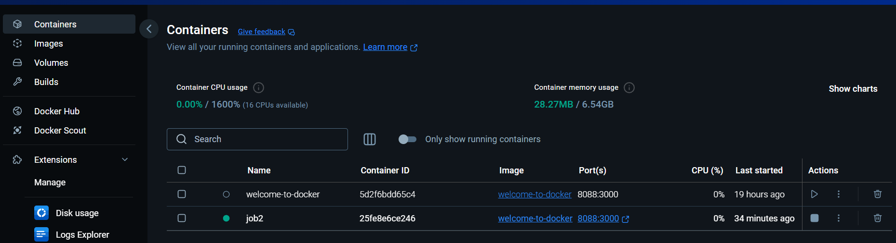

## Étape 9 : Modifier le projet

9. **Retournez dans Visual Studio et codez quelques lignes :**
   - Modifiez le code source de votre projet.

   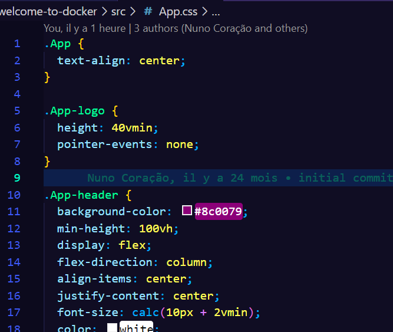

## Étape 10 : Vérifier les modifications

10. **Vérifiez que les modifications sont prises en compte :**
    - Reconstruisez l'image Docker et relancez le conteneur pour vérifier les modifications.

    

## Étape 11 : Publier l'image Docker

11. **Publiez l'image Docker sur votre compte Docker Hub :**
    - Utilisez les commandes `docker tag` et `docker push` pour publier l'image.

    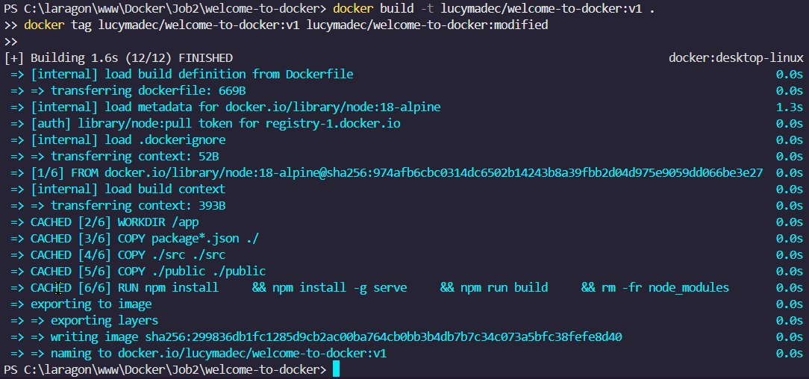

## Étape 12 : Récupérer et modifier une image d'un membre de la promo

12. **Récupérez une image Docker d'un membre de votre promo :**
    - Utilisez la commande `docker pull` pour récupérer l'image.
    
    - docker create --name temp-container lucymadec/welcome-to-docker:v1

    - docker cp temp-container:/app/src ./src

    - docker run -d -p 8088:3000 --name temp-container lucymadec/welcome-to-docker:v1 

   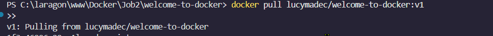
 
1.  **Modifiez et testez l'image :**
    - Apportez des modifications et testez-les.

    

2.  **Publiez l'image modifiée :**
    - Publiez l'image modifiée sur Docker Hub.

    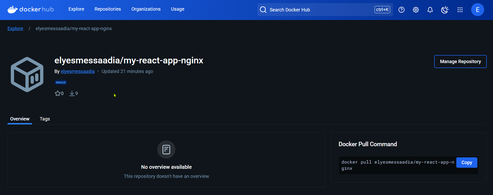

    wJKUdUY