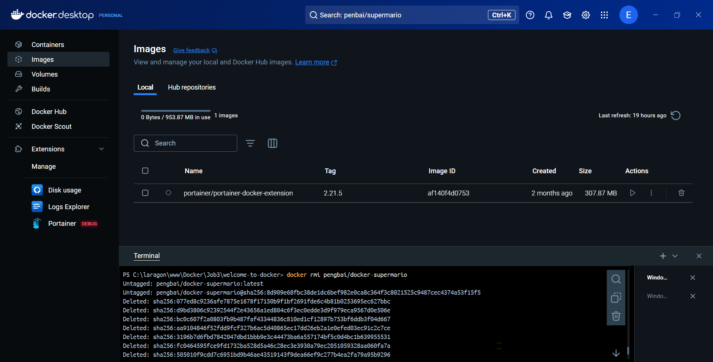

Étapes
1. Ouvrir Docker Desktop

Lancez Docker Desktop sur votre machine.

2. Accéder au Menu "Images"

Dans le menu de gauche, cliquez sur "Images" pour voir la liste des images Docker disponibles.

3. Trouver le Terminal dans Docker Desktop

Ouvrez un terminal intégré dans Docker Desktop ou utilisez un terminal externe configuré pour Docker.

4. Chercher une Image Docker

Utilisez la commande suivante pour chercher une image Docker :

    docker search <nom_image>

1. Récupérer l'Image Docker

Téléchargez l'image souhaitée avec la commande :

    docker pull <nom_image>

6. Lancer un Conteneur

Lancez un conteneur avec l'image téléchargée et assignez-lui le port 8600 :

    docker run -p 8600:8080 -it <nom_image>

7. Lancer une Autre Image (Super Mario)

Téléchargez une image de Super Mario :

    docker pull <nom_image_super_mario>

Lancez le conteneur sur un port différent :

    docker run -p <nouveau_port>:8080 -it <nom_image_super_mario>

 
    
8. Accéder au Conteneur via un Navigateur

Ouvrez votre navigateur et accédez à http://localhost:<nouveau_port> pour jouer à Super Mario.

9. Arrêter le Conteneur

Arrêtez le conteneur en utilisant son ID :

    docker stop <container_id>

    
10. Supprimer le Conteneur

Supprimez le conteneur avec la commande :

    docker rm <container_id>

    
11. Supprimer l'Image Docker de Super Mario

Supprimez l'image Docker de Super Mario :

    docker rmi <image_id>

