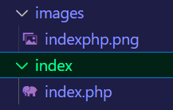
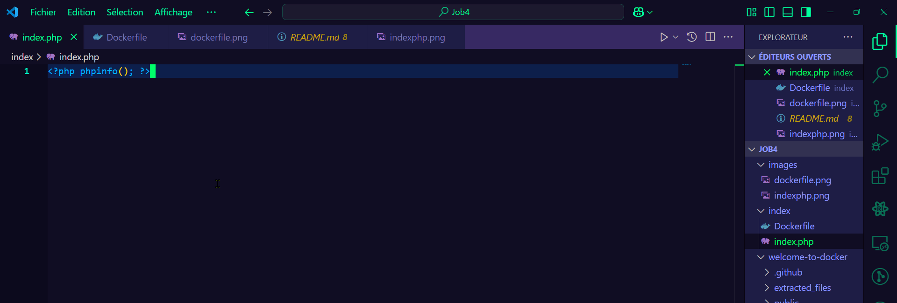
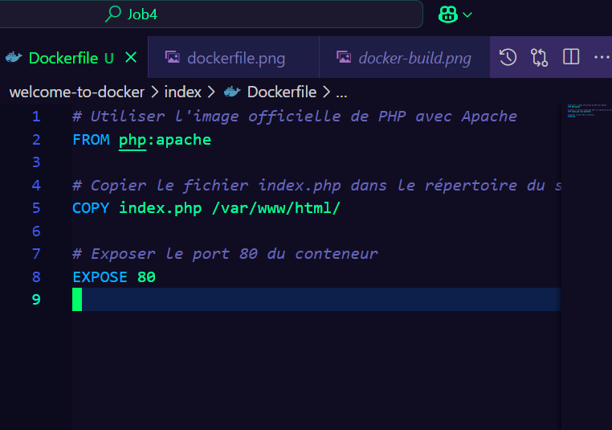
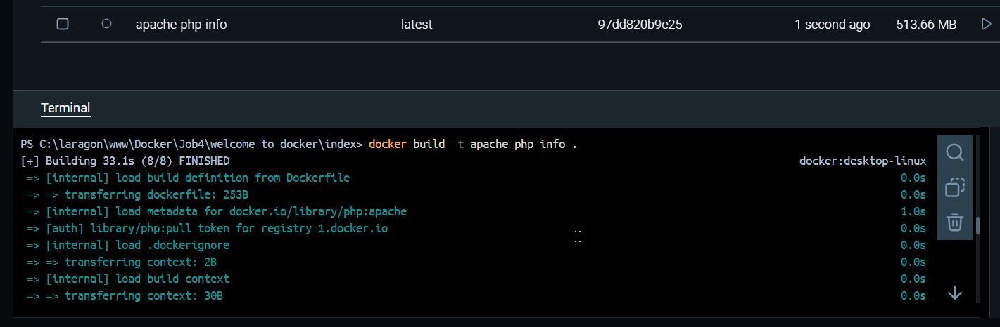
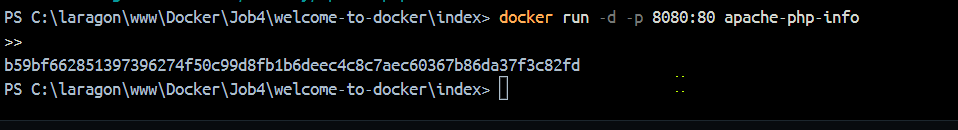
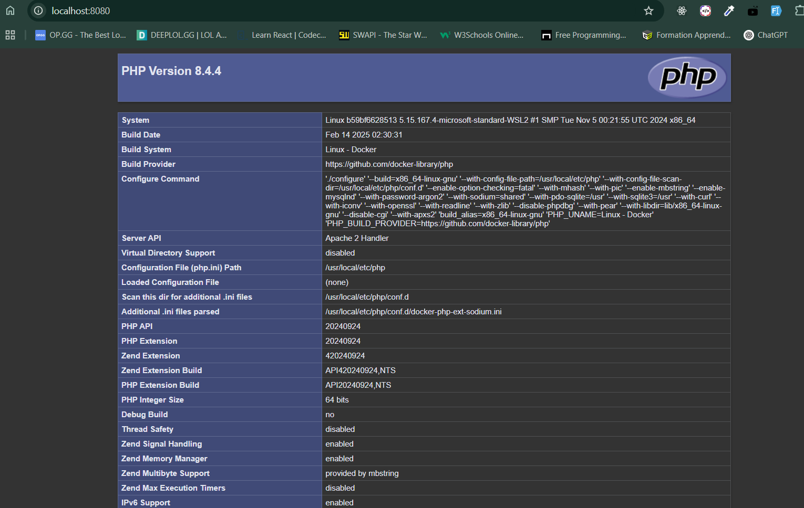
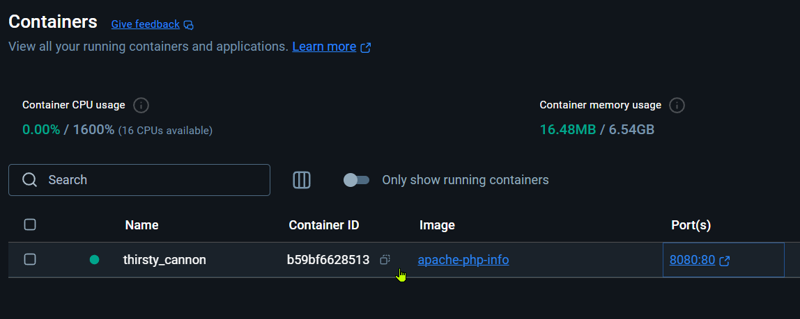
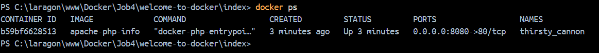
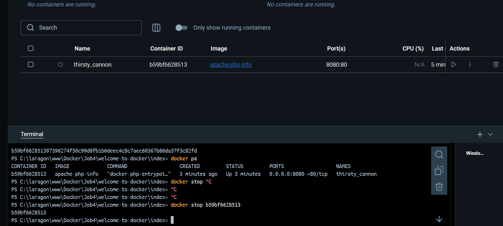

1. Créer le Fichier index.php
Créer le Fichier :

Créez un fichier nommé index.php dans un répertoire de votre choix.

Ajouter le Code PHP :

Ajoutez le code suivant dans le fichier index.php pour afficher les informations du serveur Apache :

<?php phpinfo(); ?>

Cette commande PHP affiche les informations sur le serveur Apache.

2. Créer le Dockerfile

Créer le Fichier Dockerfile :

Dans le même répertoire que index.php, créez un fichier nommé Dockerfile.

Ajouter les Instructions Docker :

Ajoutez les instructions suivantes dans le Dockerfile pour configurer un environnement Apache :

# Utiliser l'image officielle de PHP avec Apache
FROM php:apache

# Copier le fichier index.php dans le répertoire du serveur web
COPY index.php /var/www/html/

# Exposer le port 80 du conteneur
EXPOSE 80

3. Construire l'Image Docker
Ouvrir un Terminal :

Ouvrez un terminal dans le répertoire contenant le Dockerfile et le fichier index.php.

Construire l'Image :

Utilisez la commande suivante pour construire l'image Docker :

docker build -t apache-php-info .
Cette commande crée une image Docker nommée apache-php-info.
4. Créer et Lancer le Conteneur
Créer et Lancer le Conteneur :

Utilisez la commande suivante pour créer et lancer un conteneur à partir de l'image apache-php-info, en mappant le port 8080 de votre machine hôte au port 80 du conteneur :

docker run -d -p 8080:80 apache-php-info
Accéder à l'Application :

Ouvrez votre navigateur et accédez à http://localhost:8080 pour voir les informations du serveur Apache.

5. Arrêter le Conteneur
Trouver l'ID du Conteneur : 

Utilisez la commande suivante pour lister les conteneurs en cours d'exécution :

docker ps

Notez l'ID du conteneur que vous souhaitez arrêter.
Arrêter le Conteneur :
Utilisez la commande suivante pour arrêter le conteneur :

docker stop <container_id>
Remplacez <container_id> par l'ID du conteneur que vous avez noté.